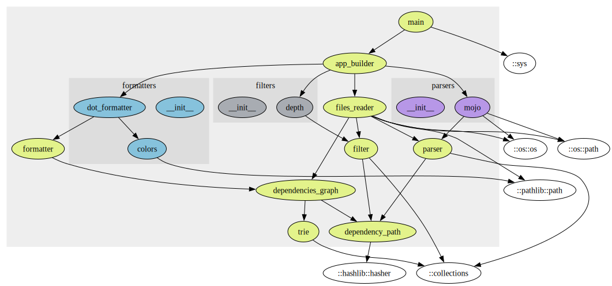

<!--
 Copyright 2025 Thomas Hügel.
 This file is part of Mojo Graphmod.
 SPDX-License-Identifier: GPL-3.0-only
-->


# Mojo Graphmod

A command for building Graphviz DOT files of dependency graphs between the modules of a package.


## Prerequisites

You need to install:
* [Graphviz](https://graphviz.org/)
* the Mojo language.


## Usage

```ignore
pixi run mojo run path/to/your/project depth project_name  > modules.dot
tred modules.dot | dot -Tpdf > modules.pdf
```

The depth indicates the maximum depth your want to visualize (0 for infinity).

* Use `tred` if you want the transitive reduction of the graph.
* You can export to [a lot of different formats](https://graphviz.org/docs/outputs/).


## License

`Mojo Graphmod` is released under the terms of the GPLv3 license.


## Mojo Graphmod's graph



